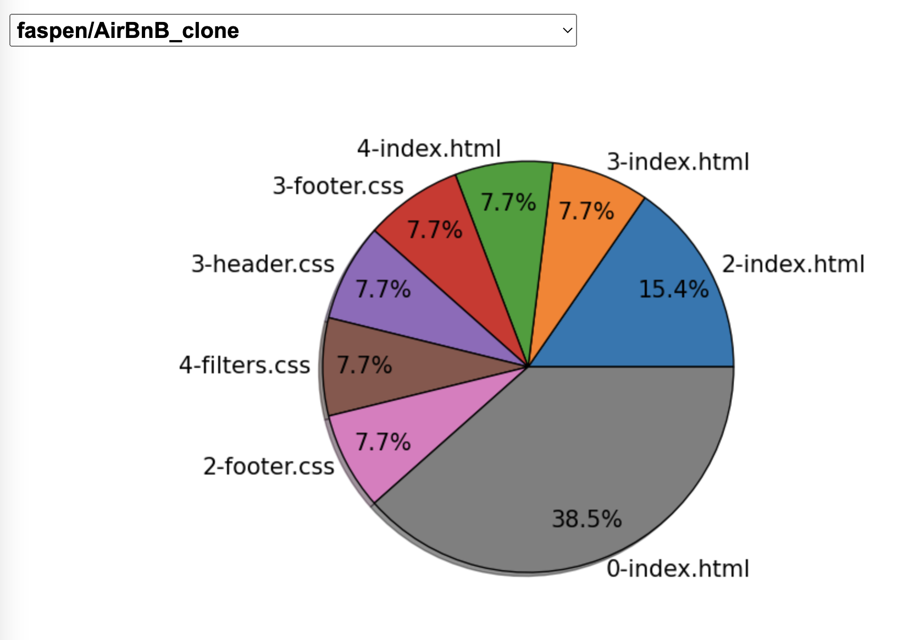
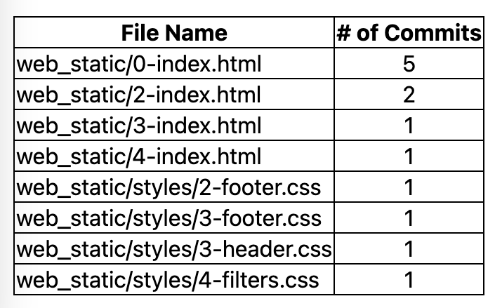

# dragonfly-github-app

## What is dragonfly?

* dragonfly is a downloadable github app that can be installed on any number of your repositories

* When used, it will scan the chosen repository, returning both a pie chart and table displaying the commit data of certain files

* These files will have a number, which is the total number of commits that had the words "fix", "bug", or "issue"

* It is a code maturity tool that helps developers to familiarize themselves with a new codebase and pinpoints important or troublesome files

## Installation

This app can be installed [here](https://github.com/apps/dragonfly-analytics).

## Using dragonfly

When using the app, a new tab displaying the the dragonfly dashboard will be opened. Right below the header is the drop-down menu. Finn Aspenson's [AirBnB_clone](https://github.com/faspen/AirBnB_clone) project will be used as an example.

This menu can cycle between all the repositories you have installed dragonfly on. For the chosen repository is a pie chart and table listed below.

The pie chart provides a nice visualization the data, showing which files contain the most amount of commits with the bug-related keywords. Below the pie chart is a table.

The table gives a more straightforward display of the data, showing the full paths of the files as well as the number of commits associated with they keywords rather than a percentage.

## Contributions

Pull requests and issues are welcome. Please leave detailed comments about any changes you make.

## Related Projects

* [erikbern/git-of-theseus](https://github.com/erikbern/git-of-theseus)

* [ejwa/gitinspector](https://github.com/ejwa/gitinspector)

## Authors

* Maddi Laizure - [Github](https://github.com/mlaizure) & [LinkedIn](https://www.linkedin.com/in/maddi-laizure/)

* Corbin Vandeventer - [Github](https://github.com/forstupidityonly) & [LinkedIn](https://www.linkedin.com/in/corbin-vandeventer-6551b71a9/)

* Finn Aspenson - [Github](https://github.com/faspen) & [LinkedIn](https://www.linkedin.com/in/finn-aspenson-0a23841b6/)